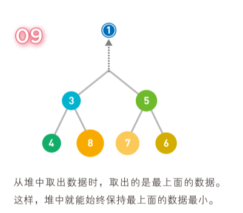
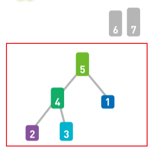
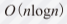

# 初步学习计划

【1】通读文章 串基本结构&实现过程——上传至CSDN（分块儿）

【2】精读文章 增添流程图进入笔记——更新至CSDN文章

【3】研究各个部分的算法——同步更新至CSDN文章

# 数据结构

根据 算法——选择数据结构 这是我们需要去思考的问题

主要去考虑——

- 排序

- 建表

- 插入

- 删除

## 1.什么是数据结构

### 1.1 决定了数据的顺序和位置关系

*数据存储于计算机的内存中

而数据存储于内存时，决定了**数据顺序**和**位置**关系的便是“数据结构”

### 1.2 例子——电话簿的数据机构

【1】从上到下按照录入的顺序添加联系人

【2】按姓名的拼音顺序排列联系人

> 两种方法的优缺点：
>
> 【1】按照顺序排列，
>
> 添加数据简单（只要把数据加载最后就可以了）
>
> 查询时很麻烦！
>
> 【2】按拼音顺序来排列，
>
> 查询简单
>
> 添加数据很麻烦！

【3】获取顺序&拼音顺序结合起来

将二者的优点结合起来（又好记 又好找）

分别**用不同的表存储不同的拼音首字母**


### 1.3 选择合适的数据结构可以提高内存的利用率

数据结构方面的思路也和制作电话簿时的一样。

将数据**存于内存时**，根据使用目的 ==选用合适的数据结构==，这样可以提高内存的利用率。

数据在内存中是呈**线性**排列的 但是我们也可以使用指针等道具 构造出类似“树形”的复杂结构。

> 在本章 我们将学习7种数据结构
>
> “树形结构”将于“图的搜索-广度优先搜索”中详细说明

## 链表

链表是数据呈线性排列的一种数据结构。

在链表中：

数据的**添加和删除**都较为方便；

但是**访问比较耗费时间**。

### 数据结构的概念图


### 基本概念

- 链表中，数据一般都是**分散存储**于内存中的，无序存储在连续空间内。


- 因为数据都是分散存储的 所以如果想要访问数据 只能从第一个开始，**顺着指向**一一往下访问（即顺序访问）


想找到Red 还得经过Yellow 


- 想要**添加数据** 只需要<u>改变</u>添加位置前后的<u>指针指向</u>即可。 时间复杂度为O(n)


- 想要**删除数据** 同样只需要<u>改变</u>指针的<u>指向</u>就可以了。


### 分析

链表的操作所需的运行时间（时间复杂度）是多少呢？

我们把链表中的数据量记为n 进行一个简单的时间复杂度的分析

- 访问数据时，

线性查找时间复杂度 O(n) ——从链表头部开始（线性）查找

- 添加数据——O(1)——改两个指针的指向就行了

- 删除数据——O(1)——改一个指针的指向就行了（绕过被删除的数据）

### 补充说明

上面讲述的链表是最基本的一种 尾部无指针 每个数据只有一个指针

除此之外 还有：

> 循环链表

尾部有一个指向链表头部的指针 

循环链表没有头和尾的概念


**用途：**保存<u>数量固定的最新数据</u>时通常使用

> 双向链表

每个数据都有两个指针 分别指向前后数据


**用途：**不仅可以从前往后遍历数据 也可以从后往前 方便~~

**缺点：**【1】指针增加——>存储空间需求增加

【2】添加&删除数据时需要改变更多指针的指向

## 数组

数组也是数据呈线性排列的一种数据结构。

与链表不同的是：

数组中 **访问数据十分简单**；

数据的添加和删除比较耗费功夫。

> 这与1-1节中讲到的姓名按照拼音顺序排列的电话簿类似。

### 数据结构的概念图


### 基本概念

- 数据**按照顺序存储**在内存的连续空间内


- 随机访问：通过数组下标（索引）算出**每个数据的内存地址**（即在内存上的位置）我们可以借此<u>直接访问目标数据！</u>


例如：想访问Red 使用指针就只能从头开始查找 用数组只要制定下a[2]就可以直接访问Red


- 添加数据较为困难

eg：

【1】数组末尾确保需要增加的存储空间


【2】接下来 为了给新数据腾出位置 要把已有数据一个个地移开


直到移出来一个空位~

并且【3】在空位写入Green


添加数据完成。

- 删除数据

【1】确定删掉的数据


【2】把a[1]之后的数据依次向前移动

直到


最后【3】再删掉多余的空间  


Green这样就被删掉了 可见 如果数据多起来以后 一个个移动 复杂度太高了！

### 分析

- 访问数据 O(1)——随机访问 通过下标课计算出内存地址
- 添加新数据 O(n)——在数组头部添加的极限情况
- 删除数据O(n)——同理 需要把数据一个个地进行移动

### 补充说明 

链表和数组学完咯 这两个数据结构中 数据都是**线性**地排成一列

二者各有特点 其中：


根据需要（使用哪种操作较为频繁）来决定使用哪种数据结构~

## 栈

栈也是数据呈线性排列的一种数据结构。

结构特征：

只能访问最新添加的数据。

### 数据结构的概念图


### 基本概念

- 入栈


- 出栈


### 分析

- 栈 是“后进先出”的结构 称为 “Last In First Out” LIFO
- 栈的数据也是线性排列 但是在栈中 **添加和删除数据**的操作只能在一端进行。
- **访问数据**也只能访问到顶端的数据——要想访问中间的数据 必须通过出栈操作将目标数据移到栈顶才行

### 补充说明 

只需要访问最新数据的时候 使用 栈 比较方便

例如：

1. 规定（AB（C（DE）F）（G（（H）I J）K））这一串字符中括号的处理方式 如下：首先从左边开始读取字符，读到左括号就将其入栈，读到右括号就将栈顶的左括号出栈。——————用栈处理可以得知配对括号的具体位置。
2. **深度优先搜索算法** 通常 会选择**最新的数据**作为候补顶点 。可以用栈管理候补顶点~

## 队列

线性排列。

结构特征：

队列中添加&删除数据的操作分别在两端进行

### 数据结构的概念图


### 基本概念

- 入队 


- 出队


### 分析

- 类似栈 添加 删除数据在两端进行 
- 访问 不能直接访问位于中间的数据 必须通过出队操作将目标数据变成首位才能访问

### 补充说明 

主要思想：先来的数据先处理

主要应用：**广度优先搜索算法** 通常从搜索候补中选择**最早的数据**作为下一个顶点 此时 候补顶点的管理上就可以使用队列。

*深度优先搜索算法要最新的~


## 哈希表

这种数据结构中使用”安全算法-哈希函数“中讲解的哈希函数 可以使数据的查询效率得到显著提升

> 安全算法-哈希函数

### 数据结构的概念图


**数组 （在这里跟哈希表做一个对比）


### 基本概念

- 线性查找（从第一个开始一点点找）


【1】首先分析数组的线性查找

需要从头开始 顺着找


查找到第4号箱子的时候 取出性别 这个数据 

这种方法太耗时了！

所以此处不适合使用数组来存储数据

【2】使用哈希表解决

- 准备好数据
- 存入第一个名字Joe 用哈希函数计算Joe的哈希值


- 得到字符串的哈希值并**作求余运算**(mod运算) 得到**几** 就存入第**几**号箱子


- 以此类推


- 如果出现冲突：可以用链表在已有数据后面继续存储新的数据


- 依次类推地存储完所有数据 **哈希表**也就制作完成了


- 想知道“**Dan**”存储在哪个箱子里 
 (**不用**像数组一样 做线性查找（从头开始））
做法：【1】算出Dan键的哈希值 【2】对哈希值进行mod运算 【3】取余得4 得知Dan存储在4号箱中 查看4号箱 数据的键与Dan一致 于是取出对应的值


- 想知道“**Alley**”的性别 （在3号箱子的后面）

做法：【1】算出哈希值 进行mod运算 【2】取余得3 发现3号箱中存的是Joe 【3】对Joe所在链表进行线性查找 取出对应的值 


### 分析

- 在哈希表中 我们可以利用哈希函数快速访问到数组中的目标数据 如果发生哈希冲突就用**链表**进行存储————不管数据量为多少 我们都能灵活应对。
- 数组空间太小——使用哈希表的时候容易发生冲突


这样线性查找的使用效率过高

- 数组空间太大 ——出现很多空盒子 浪费内存
- 所以——

> 给数组设定合适的空间非常重要

### 补充说明 

【1】解决冲突的几种方法：

- 1.发生冲突时  可以利用链表在已有数据后面插入新数据来解决冲突 称为 链地址法


- 2.开放地址法 冲突发生时 马上计算出一个候补地址（数组上的位置）并将数据存进去 如果还是有冲突 继续计算下一个候补地址 知道有空地址

- > 计算候补地址：使用哈希函数 线性探测法


## 堆

是一种图的树形结构

被用于**实现“优先队列”**

> 优先队列可以自由添加数据
>
> 但是 取出数据时要从最小值开始按顺序取出

在堆的树形结构中 各个顶点被称为“结点”
数据就存储在这些结点中。

> 参考：图的搜索-什么是图&广度优先搜索

### 数据结构的概念图


### 基本概念

子结点必定大于父结点

——所以最小值被存储在顶端的根结点中

#### 添加数据

往堆中添加数据时 因为新的数据加入

整体的排列顺序可能不符合规则“子结点必大于父结点”

为了遵守这条规则 

1）把新数据放在最下面一行靠左的位置 


2）最下面一行里没有多余空间时 再往下另起一行 把数据加在这一行的最左端

3）如果父结点大于子结点 则交换这两者 直到符合规则为止


#### 取出数据

取出的是最上面的数据——保证最上面的数据最小

问题是 之后的结构要怎么调整呢？

举个例子




### 分析

来看一种案例：

往堆里添加数字5


### 补充说明 

【1】堆中最顶端的数据始终最小 所以无论数据量有多少取出最小值的时间复杂度都为O(1)。

【2】因为取出数据后需要**将最后的数据移到最顶端** 一边比较此数据与子结点数据的大小 一边**往下移动**。所以 取出数据所需要的的运行时间与树的高度成正比。

虽然取出最小值的时间复杂度为O（1）但是重构树的时间复杂度为O(logn)

【3】添加数据和重构树是一样的 

在堆的最后添加数据后 数据会一边比较它与父结点数据的大小 一边往上移动直到满足堆的条件为止

 添加数据需要的运行时间为O(logn)

【4】如果**需要频繁地从管理的数据中取出最小值**——用堆来操作会很方便！

例如迪克斯特拉算法——每一步都需要从候补顶点中选择距离起点最近的那个顶点——用堆来存储数据就完事了~

## 二叉查找树

（也叫作二叉搜索树 或 二叉排序树）

采用了图的树形结构

数据存储于二叉查找树的各个结点中。

> 参考：图的搜索-什么是图&广度优先搜索

### 数据结构的概念图


### 基本概念

#### 基本性质

【1】每个结点的均值都大于其左子树上任意一个结点的值


【2】每个结点的值均小于其右子树上任意一个结点的值


得到结论：

二叉查找树的**最小结点**要从顶端开始往其左下的末端寻找


### 分析

#### 1.向二叉查找树中添加数据


按照此规律进行换位 直到下面没有结点 完成1的添加操作~


#### 2.在二叉查找树中删除数据

##### 2.1 要删除的结点只有一个子结点


##### 2.2 要删除的结点有2个子结点

（因为是 二叉查找树嘛 所以最多就是两个子结点咯）


#### 3.在二叉查找树中查找结点


从顶端结点开始往下查找（和添加数据时一样） **把12和结点中的值进行比较**。

小？——左移

大？——右移


### 补充说明 

【1】二叉查找树——**二分查找算法**思想的树形结构体现。

【2】向二叉查找树中添加数据的时候 比较的次数取决于树的高度 

结点数=n 树形比较均衡——比较大小和移动次数最多为log2(n)——时间复杂度为O(log2(n))

结点数=n 树单侧纵向延伸——时间复杂度为O(n)

# 排序

p57开始

## 什么是排序

将数字按从小到大的顺序排列

排序是比较基础的一个问题 所以排序算法的种类也比较多

接下来的几节将对各种排序算法进行介绍。

## 冒泡排序n^2

重复

> 从序列右边开始比较相邻两个数字的大小
>
> 再根据结果交换两个数字的位置

这一操作。

在这个过程中 数字会像泡泡一样 慢慢从右往左 “浮”到序列的顶端 

所以这个算法才被成为“冒泡排序”

### 实现过程

【1】“放置一个小天平”


【2】直到天平到达最左边~ 这样一轮下来 序列中最小的数字会移动到最左边


【3】继续重复这样的操作


【4】操作到所有数字都归位为止


### 分析

第一轮比较n-1次

第二轮比较n-2次

……

第n-1轮比较1次

在一次完整的冒泡排序中 不管数字排列顺序是什么样子 总的比较次数都是次

所以时间复杂度为


### 算法


## 选择排序n^2

重复

> 从待排序的数据中寻找最小值
>
> 将其与序列最左边的数字进行交换

这一操作。

在序列中寻找最小值时使用的是**线性查找**。

### 实现过程


以此类推


### 分析

选择排序用了线性查找来寻找最小值

第一轮 比较n-1个数找出最小值

第二轮 比较n-2个数

…

第n-1轮 比较1个数

时间复杂度跟冒泡排序一样 为

### 算法

 ```c++

 ```

## 插入排序n^2

从序列左端开始依次对数据进行排序的算法

排序过程中 

> 左侧的数据陆续归位
>
> 右侧留下的是还未被排序的数据

排序的思路：

> 从右侧的未排序区域内取出一个数据
>
> 然后将其插入到已排序区域内合适的位置上

### 实现过程

【1】进行假设


【2】开始第一轮比较


【3】重复以上操作 直到所有数字都变成“已归位”状态

### 分析

第二轮 操作1次（这里应该把第一轮当做是将最左边数字算为“已归位”）
第三轮 操作2次

…

第n轮 操作n-1次

时间复杂度又跟冒泡排序是一样的~

### 算法


## 堆排序n*log2n

利用了数据结构中的堆

> 参考 数据结构-堆


### 实现过程

【1】在堆中存储所有的数据

此出为降序排列的堆  所以与升序的原则是相反的


【2】先取出最大的数据 取完（树中）所有数据之后 将取出的数据反序输出——排序完成


【3】注意要重新构造堆

、

【4】以此类推 重复上述操作直到堆变空


### 分析

堆排序与其他形式的排序的区别在于 一开始需要将n个数据存进堆里 所需时间为

在**进行排序的时候 每轮要取出最大的数据并重构堆** 这一过程所需时间为

因为一共有n轮这样的排序 所以整体来看 堆排序的时间复杂度为


总的来看 堆排序的运行时间 比之前提到的冒泡排序 选择排序 插入排序的时间都短  

但是！堆排序实在是一个相对复杂的数据结构 所以实现起来也较为困难。

### 补充分析

一般来说 需要排序的数据都存储在数组中   虽说我们在这里使用了堆

但是这里相当于将堆嵌入到包含了序列的数组中 然后在数组中通过交换数据来进行排序。

具体来说 就是让堆中的各结点和数组像下图这样呈现对应关系


### 算法

 

## 归并排序n*log2n

重复进行以下操作 直到所有子序列都归并为一个整体为止

> 把序列分成长度相同的两个子序列’
>
> 无法继续往下分时（每个子序列中只有一个数据时）
>
> 对子序列进行归并

归并：

> 把 两个排好序的子序列合并成一个有序序列

### 实现过程


接下来 往回进行排列


直到完全排序好


### 分析

归并排序中 分隔序列所花费的时间不算在运行时间内（可以当作序列本来就是分隔好的）

在合并两个已经排好序的子序列时，只需要重复比较首位数据的大小然后移动较小的数据就ok~效率提升！

只用花费两个子序列长度相应的运行时间~~

也就是说**完成一行归并所需的运行时间取决于这一行的数据量**。


一共四个部分

每一个部分都有n个数据 所以每个部分进行归并的运行时间都为

将长度为n的序列对半分隔直到只有一个数据为止时，可以分成，也就是上面说的log2n个**部分**

所以总运行时间为，与堆排序相同

### 算法

 

## 快速排序

> 首先在序列中随机选择一个基准值（pivot）
>
> 然后将除了基准值以外的数分为两个类别：
>
> 1.<基准数     2.>基准数

即为

【小于基准数的值】基准数【大于基准数的值】

> 接着继续进行两个“【】”中的排序 完成整体的排序
>
> 这两个【】中的排序也使用如上方法——套娃

### 实现过程


### 分析


### 算法

 

### 实现过程


### 算法

 

# 数组的查找

## 线性查找

线性查找是一种在数组中查找数据的算法

与下面的二分查找不同 即使数据**没有按顺序存储** 也可以应用线性查找

线性查找的操作很简单：

> 从数组中从头开始依次往下查找即可

虽然存储的数据类型没有限制 但是为了便于理解 我们**假设存储的是整数**

### 实现过程


### 算法


## 二分查找

同样是一种在数组中查找数据的算法

与线性查找不同：

二分查找只能查找已经排好序的数据

重复：

> 通过比较数组中间的数据与目标数据的大小
>
> 得知目标数据是在数组的左边还是右边
>
> 比较一次可以把查找范围缩小一半

操作 即可找到目标数据或者得出目标数据不存在的结论。

### 实现过程


### 分析


### 算法


# 图的搜索

## 什么是图

### 1.离散数学中的图


上图中的圆圈叫做”顶点”（“结点”）

连接顶点的线叫做“边”

图：

> 由结点（顶点）和连接每对顶点的边所构成的图形。

### 2.图可以表现各种关系


### 3.加权图


### 4.有向图


### 5.图能给我们带来哪些便利


### 6.“图的搜索”章节知识点

本章将要学习的是：

> 图的搜索算法；

学完本章 可以解决：

> 图的基本问题——最短路径问题的算法。

#### 图的搜索问题

从图的某一顶点开始 ，通过边到达不同的顶点，最终找到目标顶点的过程。

根据搜索顺序不同 图的搜索算法可分为“广度优先搜索”&“深度优先搜索”两种。

#### 最短路径问题

和前文提到的一样

就是要：

>  在从s到t的路径中，找到一条**所经过的边的权重总和最小**的路径。

## 广度优先搜索

是一种对图进行搜索的算法

假设：

> 我们一开始位于某个顶点（即起点）
>
> 此时我们并不知道图的整体结构

我们的目的是：

> 从起点开始顺着边搜索
>
> 直到到达指定顶点（终点）

广度优先搜索会：

> 每走到一个顶点 就会判断一次它是否为重点
>
> 并且优先从离起点近的顶点开始搜索

### 实现过程


### 分析


### 算法


## 深度优先搜索

与广度搜索一样 都是对图进行搜索的算法

目的同样是：

> 从起点开始搜索直到 到达指定顶点（重点）

深度优先搜索会：

> 沿着一条路径不断往下搜索直到不能再继续为止
>
> 然后再折返 开始搜索下一条后补路径

### 实现过程


### 分析


### 算法


## 贝尔曼 - 福特算法

是一种在图中求解最短路径问题的算法

最短路径问题就是：

> 在加权图**指定了起点和终点**的前提下
>
> **寻找**从起点到终点的路径中**权重总和最小的那条路径**

### 实现过程


### 分析


### 算法


## 迪克斯特拉算法

与前面提到的贝尔曼-福特算法类似

Dijkstra算法也是求解最短路径问题的算法

使用它可以求得：

> 从起点到终点的路径中权重总和最小的那条路径

### 实现过程


### 分析


### 算法


## A*算法

A-star算法也是一种在图中求解最短路径问题的算法 由Dijkstra算法发展而来

Dijkstra算法会：

> 从离起点近的顶点开始 按顺序求出起点到各个部分的最短路径

这意味着：

> 一些离终点较远的顶点的最短路径也会被计算出来
>
> ——但这部分是无用的

与Dijkstra算法不同 A-star算法会：

> 预先估算一个值 并利用这个值来省去一些无用的计算


### 实现过程


### 分析


### 算法


# 安全算法

## 安全和算法

### 1.互联网中不可或缺的安全技术

通过互联网交换数据时，数据要经过各种各样的网络&设备才能传到对方那里。

数据再传输过程中有可能会经过某些恶意用户的设备

——从而导致内容被盗取。

因此 想要安全地使用互联网 安全技术是不可或缺的。

本章将要学习的就是保障安全的各种算法&利用了这些算法的机制。

### 2.传输数据时的四个问题

互联网传输数据时 可能会发生的四个主要问题：

> 窃听

A向B发送的消息可能会在传输途中被X偷看 这就是窃听

> 假冒

我向小颖发送了消息 但是小颖可能是小樱假冒的 

反过来 同理

> 篡改

即使小颖确实收到了我发送的消息 大师也有可能向下图这样 消息的内容在途中就被X整改了

> 事后否认

小颖从我这里收到了消息 

但是作为消息发送者的我可能对小颖抱有恶意 并且在事后声称：

> “这不是我发送的消息”

这种情况会导致互联网上的商业交易或者合同签署无法成立。

以上这些问题不光发生在 **用户之间交流的时候** 也有可能发生在**用户浏览网页的时候**。

### 解决这些问题的安全技术

为了解决这些问题 我们需要使用哪些安全技术呢？

针对这四个问题 分别找到应对方法：

> 窃听——加密技术
>
> 假冒——消息验证码/数字签名
>
> 篡改——消息验证码/数字签名
>
> 事后否认——数字签名

> 其中”数字签名“技术存在“无法确认公开密钥的制作者”这一问题。

为了解决这个问题，可以使用：

> 数字证书技术

接下来慢慢介绍这些技术

## 加密的基础知识

对数据进行加密和解密时，计算机会进行哪些处理呢？

接下来对“**加密技术的必要性和基本原理**”进行学习。

### 实现过程


### 分析

【1】可逆

## 哈希函数

**哈希函数**可以把给定的数据转换成固定长度的无规律数值。

转换后的无规律数值可以作为数据摘要应用于各种各样的场景。

### 实现过程


### 分析

【1】不可逆

## 共享密钥加密

加密数据的方法分为两种：

> 加密和解密都**使用相同密钥**的“共享密钥加密”

> **分别使用不同密钥**的“公开密钥加密”

本节将讲解**共享密钥加密**的机制及其相关问题。

### 实现过程


### 分析

需要解决“把密钥安全送出”这个问题

即为“密钥分配问题”

可以使用 密钥交换协议 和 公开密钥加密 两种方法

## 公开密钥加密

加密&解密**使用不同密钥**的一种加密方法。

由于使用的密钥不同 所以这种算法也被成为“非对称加密”

- 公开密钥——加密用的密钥
- 私有密钥——解密用的密钥

### 实现过程


### 分析

存在“中间人攻击”的问题 密文还是会泄露！

要解决这个问题 需要用到之后讲到的”数字证书“

另外 公开加密在“持续发送零碎数据”时 比较耗时间

这种情况下 应该用到“混合加密”

## 混合加密

共享密钥加密存在 无法安全传输密钥的密钥分配问题（不安全）

公开密钥加密又存在 加密解密速度较慢的问题（太慢）

结合这两种方法以实现互补的一种加密方法——混合加密

### 实现过程


### 分析

混合加密在 安全性&处理速度 上都有优势

能够为网络提供通信安全的**SSL协议**也应用了混合加密方式。

SSL（Secure Sockets Layer 安全套接层）经过版本升级后，变为TLS（Secure Sockets Layer 传输层安全)

该协议多被称为 SSL  或 SSL/TLS协议

> 用于 为网络提供通信安全

## 迪菲-赫尔曼密钥交换

Diffie-Hellman密钥交换是一种

> 可以在通信双方之间安全交换密钥

的方法。

这种方法通过：

> 将双方共有的秘密数值**隐藏**在公开数值相关的运算中 

来实现双方之间密钥的安全交换。

### 实现过程


### 分析


## 消息认证码

可以实现 **认证** 和 **检测篡改** 两个功能

密文的内容在传输过程中可能会被篡改 这会导致解密后的内容发生变化 从而产生误会。

消息认证码就是可以预防这种情况发生的机制

### 实现过程


### 分析


## 数字签名

数字签名不仅可以实现消息认证码的认证和检测篡改功能

还可以预防事后否认问题的发生。

由于在**消息认证码**中使用的是共享密钥加密 所以持有密钥的收信人也有可能是消息的发送者——这样是无法预防“事后否认行为”的。

而**数字签名**是只有发信人才能生成的，因此使用它就可以确定谁是消息的发送者了。

### 实现过程


### 分析


## 数字证书

> 使用数字签名后 B会相信消息的发送者就是A 但是 实际上也有可能是X冒充了A！
>
> 根本原因：使用公开密钥加密无法确定公开密钥的制作者是谁，所以公开密钥有可能是某个冒充A的人生成的，而**数字证书**可以解决这个问题。

前面提到的“公开密钥加密”和“数字签名”无法**保证**公开密钥**确实来自信息的发送者**。

因此 就算公开密钥被第三者**恶意替换** 接收方也不会注意到。

使用数字证书 来保证**公开密钥的正确性**！

### 实现过程


### 分析


# 聚类

## 什么是聚类

## k-means算法

# 其他算法

## 欧几里得算法

也叫 辗转相除法 用于**计算两个数的最大公约数** 被称为世界上最古老的算法。

### 实现过程


### 分析

使用 欧几里得算法 只需要重复做除法便能求得最大公约数。

算法优势：即使两个数字再大 按照步骤进行操作也可以高效地求得两者的最大公约数。


## 素性测试

是判断一个自然数是否为素数的测试。

素数（prime number）就是**只能被1和其自身整除 且大于1**的自然数。

eg:素数从小到大有2 3 5 7 11 13……

目前在加密技术中被广泛应用的RSA算法就会用到大素数，因此“素性测试”在该算法中起到了重要的作用。

### 实现过程


### 分析


## 网页排名

PageRank 也叫作佩奇排名

是一种在**搜索网页时对搜索结果进行排序**的算法。

Google在搜索引擎中使用了这个算法——这使他们成为了世界知名的大企业。

### 实现过程


### 分析

链入的页面越多 发出的链接的价值就越高。


之前的搜索引擎的排序方法：

> 以关键词和网页内容的关联性来决定。

这种方法没有考虑网页内是否含有有效内容 因此搜索精度较低。


Google公司使用了网页排名算法凭借其强大的性能成为世界知名企业 发展到现在 决定Google搜索结果排序的已**不仅仅**是网页排名这一个算法了。

网页排名算法的划时代性：

> 利用网页链接结构计算出网页价值——划时代！
>
> 从链接形成环状时也能进行计算（随机游走模型）——划时代

## 汉诺塔

汉诺塔 一种移动圆盘的游戏 同时也是一个简单易懂的**递归算法**应用实例。

### 实现过程


### 分析